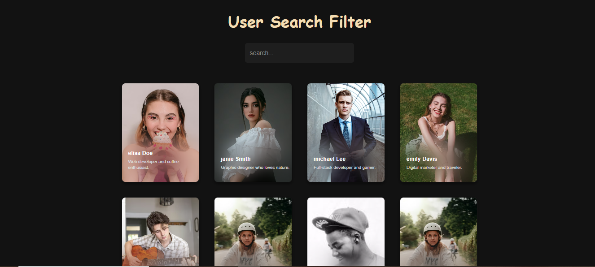
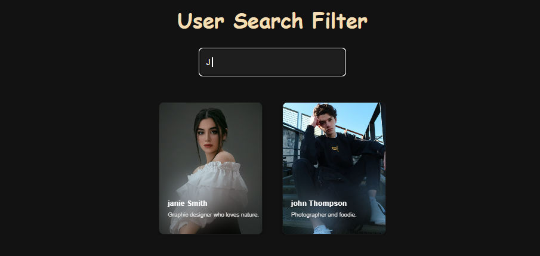

# 🔍 User Search Filter – Interactive JavaScript Project  

A **dynamic user search app** built with **HTML, CSS, and JavaScript**.  
Filter through a list of users in real-time with a **debounced search input** and see user cards with profile pictures and bios.  

🌐 **Live Demo:** [Click Here to Try It!](https://pawancodecrafts.github.io/userSearchFilter-js/)  

Screenshots for quick view:

## 🪄 Features
- 🔹 **Dynamic search:** Filter users as you type  
- ⏳ **Debounced input:** Optimized performance, prevents unnecessary function calls  
- 🖼️ **User cards:** Display profile pictures, names, and bios  
- 🙅‍♂️ **No users found:** Displays a friendly message if no results match  
- 📱 Fully responsive layout  

---

## 🚀 Tech Stack
- **HTML5** – Structure of the webpage  
- **CSS3** – Styling and responsive design  
- **JavaScript (ES6)** – DOM manipulation, filtering, and debounce logic  

---

## 💡 How to Use
1. Open the [live demo link](https://pawancodecrafts.github.io/user-search/).  
2. Type a name in the search bar.  
3. See the user cards dynamically update.  
4. If no users match, a friendly "No users found" message will appear.
